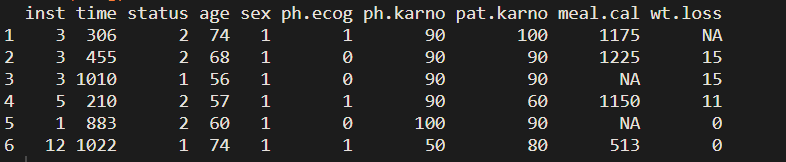

生存分析研究的是某个事件发生之前过去的时间，在临床研究中最常见的应用就是死亡率的估计(预测患者的生存时间)，不过生存分析也可以应用于其他领域如机械故障时间等。

在R中，survival包中有很多函数可以对生存数据进行建模，可以使用survfit()函数来估计删失数据的生存曲线，使用coxph()函数用来拟合Cox比例风险模型。

在survminer包中，可以使用`plot()`函数、`ggsurvplot()`函数用来绘制Kaplan-Meier生存曲线。

今天就来学习在R中使用ggsurvplot()函数绘制Kaplan-Meier生存曲线。

------

**目 录**

- [1. 安装和加载R包](https://zhuanlan.zhihu.com/p/113676828/edit)

- [2. 导入内置数据集](https://zhuanlan.zhihu.com/p/113676828/edit)

- [3. 拟合生存曲线](https://zhuanlan.zhihu.com/p/113676828/edit)

- - [3.1 创建生存对象](https://zhuanlan.zhihu.com/p/113676828/edit)
  - [3.2 拟合曲线](https://zhuanlan.zhihu.com/p/113676828/edit)

- [4. 绘制基础曲线](https://zhuanlan.zhihu.com/p/113676828/edit)

- [5. 自定义曲线参数](https://zhuanlan.zhihu.com/p/113676828/edit)

- - [5.1 增加中位生存时间](https://zhuanlan.zhihu.com/p/113676828/edit)
  - [5.2 增加置信区间](https://zhuanlan.zhihu.com/p/113676828/edit)
  - [5.3 绘制累计风险曲线](https://zhuanlan.zhihu.com/p/113676828/edit)
  - [5.4 添加风险表](https://zhuanlan.zhihu.com/p/113676828/edit)
  - [5.5 添加总患者生存曲线](https://zhuanlan.zhihu.com/p/113676828/edit)
  - [5.6 自定义调色板](https://zhuanlan.zhihu.com/p/113676828/edit)

- [6. 美化生存曲线](https://zhuanlan.zhihu.com/p/113676828/edit)

- [7. survfit()函数](https://zhuanlan.zhihu.com/p/113676828/edit)

- [8. ggsurvplot()函数](https://zhuanlan.zhihu.com/p/113676828/edit)

- - [8.1 主要参数](https://zhuanlan.zhihu.com/p/113676828/edit)
  - [8.2 图标题和坐标轴标签](https://zhuanlan.zhihu.com/p/113676828/edit)
  - [8.3 图例标题和位置](https://zhuanlan.zhihu.com/p/113676828/edit)
  - [8.4 坐标轴范围、刻度间距](https://zhuanlan.zhihu.com/p/113676828/edit)
  - [8.5 置信区间](https://zhuanlan.zhihu.com/p/113676828/edit)
  - [8.6 P值文本大小和位置](https://zhuanlan.zhihu.com/p/113676828/edit)
  - [8.7 删失点](https://zhuanlan.zhihu.com/p/113676828/edit)
  - [8.8 生存表](https://zhuanlan.zhihu.com/p/113676828/edit)
  - [8.9 生存图高度](https://zhuanlan.zhihu.com/p/113676828/edit)
  - [8.10 字体样式](https://zhuanlan.zhihu.com/p/113676828/edit)

- [End](https://zhuanlan.zhihu.com/p/113676828/edit)


------

## **1. 安装和加载R包**

绘制Kaplan-Meier生存曲线需要用到的R包：`survminer`和`survival`。

```text
如果没有安装就先安装。
install.packages("survminer") # 安装survminer包
install.packages("survival") # 安装survival包
library(survminer) # 加载包
library(survival) # 加载包
```

## **2. 导入内置数据集**

使用`survival`包的`lung`数据集进行演示。

```text
data(lung) # 加载lung数据集
View(lung) # 查看数据集
```



```text
lung数据集：NCCTG晚期肺癌患者的生存率。

inst # 机构代码；
time # 生存天数；
status # 生存状态，1为删失，2为死亡；
age # 年龄；
sex # 性别，1为男性，2为女性；
ph.ecog、ph.karno、pat.karno # 为病人和患者评分，这里用不到；
meal.cal # 进食时消耗的卡路里；
wt.loss # 最近6个月内的体重下降。
```

## **3. 拟合生存曲线**

### **3.1 创建生存对象**

在survival包中先使用Surv()函数创建生存对象，生存对象是将事件时间和删失信息合并在一起的数据结构。

```text
attach(lung) # 绑定数据集
Surv(time,status) # 创建生存对象
```


在上面输出的生存对象中，带"+"号的表示右删失数据。

### **3.2 拟合曲线**

R中使用survfit()函数来拟合生存曲线。

```text
fit <- survfit(Surv(time,status) ~ sex,  # 创建生存对象 
               data = lung) # 数据集来源
fit # 查看拟合曲线信息
```


从上图可知，lung数据集中男性138例，女性90例；男性和女性发生感兴趣结局事件分别有112例和53例。男性和女性的中位生存时间分别为`270天`和`426天`。

还可以使用summary()函数输出更多详细信息。

```text
summary(fit)
```


上图中survival为生存函数在生存时间点处的KM估计值。同时，输出结果中还给出了估计的标准误差和95%置信区间。

## **4. 绘制基础曲线**

```text
ggsurvplot(fit, data = lung)
```


## **5. 自定义曲线参数**

### **5.1 增加中位生存时间**

中位生存时间(median survival time)又称为生存时间的中位数，表示刚好有`50%`的个体其存活期大于该时间，是生存分析中常用的概括性统计量。

**图解法**是计算中位生存时间的方法。其利用生存曲线图，从纵轴生存率为50%处画一条与横轴平行的线，并与生存曲线相交，然后自交点画垂线与横轴相交，此交点对应的时间即为中位生存时间，图解法比较简单直观，但结果比较粗略。

```text
ggsurvplot(fit, data = lung,
           surv.median.line = "hv") # 增加中位生存时间
```


从图上可以看出，男性的中位生存时间小于女性。

### **5.2 增加置信区间**

```text
ggsurvplot(fit, data = lung,
           surv.median.line = "hv",  # 增加中位生存时间
           conf.int = TRUE) # 增加置信区间
```


### **5.3 绘制累计风险曲线**

```text
ggsurvplot(fit, data = lung, 
           conf.int = TRUE, # 增加置信区间
           fun = "cumhaz") # 绘制累计风险曲线
```


### **5.4 添加风险表**

```text
ggsurvplot(fit, data = lung,
           conf.int = TRUE,  # 增加置信区间
           risk.table = TRUE) # 绘制累计风险曲线
```


### **5.5 添加总患者生存曲线**

```text
ggsurvplot(fit, # 创建的拟合对象
           data = lung,  # 指定变量数据来源
           conf.int = TRUE, # 显示置信区间
           pval = TRUE, # 添加P值
           surv.median.line = "hv",  # 添加中位生存时间线
           add.all = TRUE) # 添加总患者生存曲线
```


### **5.6 自定义调色板**

```text
ggsurvplot(fit, # 创建的拟合对象
           data = lung,  # 指定变量数据来源
           conf.int = TRUE, # 显示置信区间
           pval = TRUE, # 添加P值
           surv.median.line = "hv", # 添加中位生存时间线
           palette = "hue")  # 自定义调色板
可选调色板有 "grey","npg","aaas","lancet","jco", 
"ucscgb","uchicago","simpsons"和"rickandmorty".
```


**6. 美化生存曲线**

```text
ggsurvplot(fit, # 创建的拟合对象
           data = lung,  # 指定变量数据来源
           conf.int = TRUE, # 显示置信区间
           pval = TRUE, # 添加P值
           surv.median.line = "hv",  # 添加中位生存时间线
           risk.table = TRUE, # 添加风险表
           xlab = "Follow up time(d)", # 指定x轴标签
           legend = c(0.8,0.75), # 指定图例位置
           legend.title = "", # 设置图例标题
           legend.labs = c("Male", "Female"), # 指定图例分组标签
           break.x.by = 100)  # 设置x轴刻度间距
```


## **7. survfit()函数**

```text
survfit(formula, data, weights, subset, na.action,  
        stype=1, ctype=1, id, cluster, istate, timefix=TRUE,
        etype, error,  ...)

## 参数解释
formula # 形如 Surv(time,status) ~ sex 的公式
data # 变量来源的数据集 
weights # 观察值的权重
subset # 数据集的子集
na.action # 处理缺失值的函数
id # 识别观察对象个体的变量
etype # 事件的类型
...
```

## **8. ggsurvplot()函数**

### **8.1 主要参数**

```text
ggsurvplot(fit, data = NULL, fun = NULL, color = NULL,
           palette = NULL, linetype = 1, conf.int = FALSE, 
           pval = FALSE, pval.method = FALSE, 
           test.for.trend = FALSE, surv.median.line = "none", 
           risk.table = FALSE, cumevents = FALSE,
           cumcensor = FALSE, tables.height = 0.25, 
           group.by = NULL, facet.by = NULL, add.all = FALSE, 
           combine = FALSE, ggtheme = theme_survminer(), 
           tables.theme = ggtheme, ...)

# 参数解释
fit # 拟合的生存曲线对象
data # 用来拟合生存曲线的数据集
fun  # 常用三个字符参数；
# "event"绘制累积事件(f(y)=1-y)，
# "cumhaz"绘制累积危害函数(f(y)=-log(y));
# "pct"绘制生存概率(百分比)。
color # 设置生存曲线的颜色。
# 如果只有1条曲线，则直接设置color="blue"；
# 如果有多条曲线，默认color="strata"，按分组为生存曲线着色；
# 也可以自定义调色板来设置曲线颜色。

palette # 调色板，默认"hue"。
# 可选调色板有"grey","npg","aaas","lancet", 
# "jco", "ucscgb","uchicago","simpsons"和"rickandmorty".
linetype = 1 # 设置曲线线型。可以按"strata"设置线型；
# 或按数字向量c(1, 2)或按字符向量c("solid", "dashed")设置
conf.int # 逻辑词；默认FASLE；为TRUE则绘制曲线置信区间

pval = FALSE # 逻辑词；为TRUE则将统计检验计算的p值添加到图上；
# 为数字，则直接指定P值大小，如pval = 0.03；
# 为字符串，则添加字符串到图上，如pval = "p-value: 0.031"
pval.method  # 逻辑词，是否添加计算p值的统计方法的文本；
# 只有当 pval = TRUE时, 才会在图上添加检验方法文本
test.for.trend # 逻辑词，默认为FALSE；
# 为TRUE则返回趋势p值的检验，趋势检验旨在检验生存曲线的有序差异
surv.median.line # 在中位生存时间点处绘制水平或垂直线的字符向量；
# 可用值有"none"、"hv"、"h"、"v"；其中v绘制垂直线，h绘制水平线。
risk.table = FALSE  # 逻辑词，图上是否添加风险表；
# "absolute" 显示处于风险中的绝对数量；
# "percentage" 显示处于风险中的百分比数量
# "abs_pct" 显示处于风险中的绝对数量和百分比
cumevents # 逻辑词，是否添加累计事件表
cumcensor # 逻辑词，是否添加累计删失表
tables.height = 0.25 # 生存曲线图下所有生存表的高度，数值0-1之间
group.by  # 包含分组变量名称的字符向量，向量长度≤2
facet.by # 字符向量，指定绘制分面生存曲线的分组变量(应≤2)的名称
ggtheme=theme_survminer() # 设置ggplot2主题，如theme_bw()
tables.theme # 作用于生存表的ggplot2主题名称
# 有theme_survminer、theme_cleantable()
add.all = FALSE # 逻辑词；是否添加总患者生存曲线到主生存图中
```


### **8.2 图标题和坐标轴标签**

```text
title  # 图表标题
xlab, ylab # 分别指x轴和y轴标签
```

### **8.3 图例标题和位置**

```text
legend # 指定图例位置的字符向量："top"(默认),"bottom","left","right","none"等。
# legend="none" 表示移除图例；
# 图例位置也可用数字向量c(x，y)指定，x和y的值应在0到1之间。
legend.title  # 图例标题，如legend.title = "Sex"。
legend.labs # 指定图例标签的字符向量, 替换fit中strata的名称，顺序应与strata一致。
# 如 legend.labs = c("Male","Female")
```

### **8.4 坐标轴范围、刻度间距**

```text
break.time.by # 设定坐标轴刻度间距
break.x.by # 设定x轴刻度的间距，如break.x.by = 100
break.y.by # 设定y轴刻度的间距，如break.y.by = 0.2
surv.scale # 生存曲线的比例转换。允许的值为"default"或"percent"。
xlim, ylim # 指定x轴和y轴的范围，如xlim = c(0,30), ylim = c(0,1)
axes.offset # 逻辑词，默认为TRUE。为FALSE，则生存曲线图的坐标轴从原点开始。
```

### **8.5 置信区间**

```text
以下只有在conf.int = TRUE时才生效
conf.int.fill # 设置置信区间填充的颜色
conf.int.style # 设置置信区间的类型，有"ribbon"(默认),"step"两种。
conf.int.alpha # 数值，指定置信区间填充颜色的透明度；
# 数值在0-1之间，0为完全透明，1为不透明。
```

### **8.6 P值文本大小和位置**

```text
以下只有在pval = TRUE时才生效
pval.size # 指定p值文本大小的数字，默认为 5。
pval.coord # 长度为2的数字向量，指定p值位置x、y，如pval.coord=c(x,y)。
pval.method.size # 指定检验方法 log.rank 文本的大小
pval.method.coord # 指定检验方法 log.rank 文本的坐标
log.rank.weights # 计算log-rank检验p值的权重类型的名称。
```

### **8.7 删失点**

```text
censor # 逻辑词，默认为TRUE，在图上绘制删失点。
censor.shape # 数值或字符，用于指定删失点的形状；默认为"+"(3), 可选"|"(124)。
censor.size # 指定删失点形状的大小，默认为4.5。
```

### **8.8 生存表**

所有生存表的常规参数。指定以下参数时，可应用于所有生存表（风险表、累积事件表和累积删失表）。

```text
tables.col # 生存曲线图下所有表的颜色，默认为"black"；
# 按strata显示则tables.col="strata".
fontsize # 指定风险表和累积事件表的字体大小。
font.family # 指定文字字体的字符向量,如font.family="Courier New".
tables.y.text # 逻辑词，默认显示生存表的y轴刻度标签；为FALSE则刻度标签被隐藏
tables.y.text.col # 逻辑词，默认FALSE；为TRUE，则表的y刻度标签将按strata着色。
tables.height # 指定所有生存表的高度，数值在0-1之间，默认为0.25.
```

### **8.8.1 风险表**

```text
risk.table.title #  风险表的标题
risk.table.pos # 指定风险表位置的字符向量；
# 有两种，"out"在生存图外(默认)，"in"在生存图内。
risk.table.col 
risk.table.fontsize
risk.table.y.text
risk.table.y.text.col 
risk.table.height 
# 这五个和上面生存表的常规参数意义是一样的
# 但是只应用在风险表中。
```

### **8.8.2 累积事件表**

```text
cumevents.title # 累积事件表的标题
cumevents.col
cumevents.y.text
cumevents.y.text
cumevents.height
# 这四个和上面生存表的常规参数意义是一样的
# 但是只应用于累积事件表中。
```

### **8.8.3 累积删失表**

```text
cumcensor.title # 累积删失表的标题
cumcensor.col
cumcensor.y.text
cumcensor.y.text.col
cumcensor.height
# 这四个和上面生存表的常规参数意义是一样的
# 但是只应用于累积删失表中。
```

### **8.9 生存图高度**

```text
surv.plot.height # 生存图的高度，默认为0.75；
# 当risk.table = FALSE时忽略
```

### **8.10 字体样式**

```text
font.title  # 标题字体
font.subtitle  # 副标题字体
font.caption
font.x、font.y  # x轴、y轴字体
font.tickslab  # 刻度标签字体
font.legend  # 图例字体

用长度为3的向量分别指定大小、类型、颜色。如：
# font.main = c(16, "bold", "darkblue")
# font.x = c(14, "italic", "red")
# font.y = c(14, "bold.italic", "darkred")
# font.tickslab = c(12, "plain", "darkgreen")
# font.x = 14 则只改变字体的大小
# font.x = "bold" 则只改变字体类型
```

## **End**